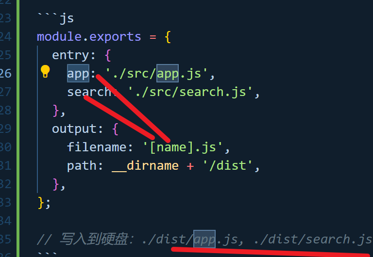

# Webapck

参考官网很重要，官网不会过时。

## 核心概念

* entry: 入口文件
* output: 输出文件
* loader:

webpack 只能理解 JavaScript 和 JSON 文件，这是 webpack 开箱可用的自带能力。loader 让 webpack 能够去处理其他类型的文件，并将它们转换为有效 模块，以供应用程序使用，以及被添加到依赖图中。

在更高层面，在 webpack 的配置中，loader 有两个属性：

test 属性，识别出哪些文件会被转换。
use 属性，定义出在进行转换时，应该使用哪个 loader。

* plugin

loader 用于转换某些类型的模块，而插件则可以用于执行范围更广的任务。包括：打包优化，资源管理，注入环境变量。

* mode: 模式

通过选择 development, production 或 none 之中的一个，来设置 mode 参数，你可以启用 webpack 内置在相应环境下的优化。其默认值为 production。

* browser compatibility: 浏览器兼容性

Webpack 支持所有符合 ES5 标准 的浏览器（不支持 IE8 及以下版本）。webpack 的 import() 和 require.ensure() 需要 Promise。如果你想要支持旧版本浏览器，在使用这些表达式之前，还需要 提前加载 polyfill。

* environment: 环境

Webpack 5 运行于 Node.js v10.13.0+ 的版本。

## 入口起点 entry point

### 单入口文件

### 多入口文件

#### 常见场景

##### :star: 分离 app(应用程序) 和 vendor(第三方库) 入口

webpack.config.js

```js
module.exports = {
  entry: {
    main: './src/app.js',
    vendor: './src/vendor.js',
  },
};
```

webpack.prod.js

```js
module.exports = {
  output: {
    filename: '[name].[contenthash].bundle.js',
  },
};
```

webpack.dev.js

```js
module.exports = {
  output: {
    filename: '[name].bundle.js',
  },
};
```

:star: 这是什么？ 这是告诉 webpack 我们想要配置 2 个单独的入口点（例如上面的示例）。

:star: 为什么？ 这样你就可以在 vendor.js 中存入未做修改的必要 library 或文件（例如 Bootstrap, jQuery, 图片等），然后将它们打包在一起成为单独的 chunk。内容哈希保持不变，这使浏览器可以独立地缓存它们，从而减少了加载时间。

而在 webpack 4 中不鼓励这样做。而是使用 optimization.splitChunks 选项，将 vendor 和 app(应用程序) 模块分开，并为其创建一个单独的文件。不要 为 vendor 或其他不是执行起点创建 entry。

##### 多页面应用程序

webpack.config.js

```js
module.exports = {
  entry: {
    pageOne: './src/pageOne/index.js',
    pageTwo: './src/pageTwo/index.js',
    pageThree: './src/pageThree/index.js',
  },
};
```

这是什么？ 我们告诉 webpack 需要三个独立分离的依赖图（如上面的示例）。

为什么？ 在多页面应用程序中，server 会拉取一个新的 HTML 文档给你的客户端。页面重新加载此新文档，并且资源被重新下载。然而，这给了我们特殊的机会去做很多事，例如使用 optimization.splitChunks 为页面间共享的应用程序代码创建 bundle。由于入口起点数量的增多，多页应用能够复用多个入口起点之间的大量代码/模块，从而可以极大地从这些技术中受益。

提示：

根据经验：每个 HTML 文档只使用一个入口起点。具体原因请参阅此 issue。

## 输出 output

可以通过配置 output 选项，告知 webpack 如何向硬盘写入编译文件。注意，即使可以存在多个 entry 起点，但只能指定一个 output 配置。

### 单入口起点

webpack.config.js

```js
module.exports = {
  output: {
    filename: 'bundle.js',
  },
};
```

### 多个入口起点

webpack.config.js

```js
module.exports = {
  entry: {
    app: './src/app.js',
    search: './src/search.js',
  },
  output: {
    filename: '[name].js',
    path: __dirname + '/dist',
  },
};

// 写入到硬盘：./dist/app.js, ./dist/search.js
```



### 高级进阶

以下是对资源使用 CDN 和 hash 的复杂示例：

config.js

```js
module.exports = {
  //...
  output: {
    path: '/home/proj/cdn/assets/[fullhash]',
    publicPath: 'https://cdn.example.com/assets/[fullhash]/',
  },
};
```

如果在编译时，不知道最终输出文件的 publicPath 是什么地址，则可以将其留空，并且在运行时通过入口起点文件中的 __webpack_public_path__ 动态设置

```js
__webpack_public_path__ = myRuntimePublicPath;

// 应用程序入口的其余部分
```

## loader

loader 用于对模块的源代码进行转换。loader 可以使你在 import 或 "load(加载)" 模块时预处理文件。因此，loader 类似于其他构建工具中“任务(task)”，并提供了处理前端构建步骤的得力方式。loader 可以将文件从不同的语言（如 TypeScript）转换为 JavaScript 或将内联图像转换为 data URL。loader 甚至允许你直接在 JavaScript 模块中 import CSS 文件！

### 用例

webpack.config.js

```js
module.exports = {
  module: {
    rules: [
      {
        test: /\.css$/,
        //loader 从右到左（或从下到上）地取值(evaluate)/执行(execute)
        use: [
          { loader: 'style-loader' },
          {
            loader: 'css-loader',
            options: {
              modules: true,
            },
          },
          { loader: 'sass-loader' },
        ],
      },
    ],
  },
};
```

### 编写自己的loader

## plugin

### 剖析

webpack 插件是一个具有 apply 方法的 JavaScript 对象。apply 方法会被 webpack compiler 调用，并且在 整个 编译生命周期都可以访问 compiler 对象。

ConsoleLogOnBuildWebpackPlugin.js

```js
const pluginName = 'ConsoleLogOnBuildWebpackPlugin';

class ConsoleLogOnBuildWebpackPlugin {
  apply(compiler) {
    compiler.hooks.run.tap(pluginName, (compilation) => {
      console.log('webpack 构建正在启动！');
    });
  }
}

module.exports = ConsoleLogOnBuildWebpackPlugin;
```

compiler hook 的 tap 方法的第一个参数，应该是驼峰式命名的插件名称。建议为此使用一个常量，以便它可以在所有 hook 中重复使用。

### 配置方式

webpack.config.js

```js
const HtmlWebpackPlugin = require('html-webpack-plugin');
const webpack = require('webpack'); // 访问内置的插件
const path = require('path');

module.exports = {
  entry: './path/to/my/entry/file.js',
  output: {
    filename: 'my-first-webpack.bundle.js',
    path: path.resolve(__dirname, 'dist'),
  },
  module: {
    rules: [
      {
        test: /\.(js|jsx)$/,
        use: 'babel-loader',
      },
    ],
  },
  plugins: [
    new webpack.ProgressPlugin(),
    new HtmlWebpackPlugin({ template: './src/index.html' }),
  ],
};
```

ProgressPlugin 用于自定义编译过程中的进度报告，HtmlWebpackPlugin 将生成一个 HTML 文件，并在其中使用 script 引入一个名为 my-first-webpack.bundle.js 的 JS 文件。

### 提示

你知道吗：以上看到的示例和 webpack 运行时(runtime)本身 极其类似。webpack 源码 中隐藏有大量使用示例，你可以将其应用在自己的配置和脚本中。
 
## 配置 （Configuration）

### 多个target

除了可以将单个配置导出为 object，function 或 Promise 以外，还可以将其导出为多个配置。

### 使用其它配置语言

Webpack 支持由多种编程和数据语言编写的配置文件。

## 模块（Modules）

### 如何理解loader和modules

Module（模块）

在 Webpack 里，Module 指的是项目中各个独立的文件或代码单元。Webpack 将项目中的所有文件（如 JavaScript、CSS、图片等）都视为模块，无论这些文件是自己编写的，还是从外部引入的第三方库。每个模块都有自己的功能和作用，并且可以通过特定的方式相互引用和依赖。
例如，在一个前端项目中，可能会有多个 JavaScript 文件，每个文件负责不同的功能，如一个文件处理用户输入，另一个文件负责与服务器通信，这些文件都可以看作是独立的模块。

Loader（加载器）

Loader 是 Webpack 中的一个重要概念，它是用于处理不同类型模块的转换器。由于 Webpack 本身只能理解 JavaScript 和 JSON 文件，对于其他类型的文件（如 CSS、图片、TS 等），就需要使用 Loader 来将这些文件转换为 Webpack 能够处理的模块。
例如，当你在项目中引入一个 CSS 文件时，Webpack 无法直接处理它，这时就需要使用 style-loader 和 css-loader 来将 CSS 文件转换为 JavaScript 模块，以便 Webpack 能够对其进行打包处理。

### 何为Webpack模块

与 Node.js 模块相比，webpack 模块能以各种方式表达它们的依赖关系。下面是一些示例：

* ES2015 import 语句
* CommonJS require() 语句
* AMD define 和 require 语句
* css/sass/less 文件中的 @import 语句。
* stylesheet url(...) 或者 HTML的 img src文件中的图片链接。

### 支持的模块类型

Webpack 天生支持如下模块类型：

* ECMAScript 模块
* CommonJS 模块
* AMD 模块
* Assets
* WebAssembly 模块

:star: 通过 loader 可以使 webpack 支持多种语言和预处理器语法编写的模块。loader 向 webpack 描述了如何处理非原生 模块，并将相关依赖引入到你的 bundles中。 webpack 社区已经为各种流行的语言和预处理器创建了 loader，其中包括：

* CoffeeScript
* TypeScript
* ESNext (Babel)
* Sass
* Less
* Stylus
* Elm

## 模块解析（Module Resolution）

### enhanced-resolve

使用 enhanced-resolve，webpack 能解析三种文件路径

* 绝对路径
* 相对路径
* 模块路径

### 解析 loader

loader 的解析规则也遵循特定的规范。但是 resolveLoader 配置项可以为 loader 设置独立的解析规则。

### 缓存

每次文件系统访问文件都会被缓存，以便于更快触发对同一文件的多个并行或串行请求。在 watch 模式 下，只有修改过的文件会被从缓存中移出。如果关闭 watch 模式，则会在每次编译前清理缓存。

## 模块联邦（Module Federation）

多个独立的构建可以组成一个应用程序，这些独立的构建之间不应该存在依赖关系，因此可以单独开发和部署它们。

这通常被称作微前端，但并不仅限于此。

## 依赖图（Dependency Graph）

每当一个文件依赖另一个文件时，webpack 都会将文件视为直接存在 依赖关系。这使得 webpack 可以获取非代码资源，如 images 或 web 字体等。并会把它们作为 依赖 提供给应用程序。

当 webpack 处理应用程序时，它会根据命令行参数中或配置文件中定义的模块列表开始处理。 从 入口 开始，webpack 会递归的构建一个 依赖关系图，这个依赖图包含着应用程序中所需的每个模块，然后将所有模块打包为少量的 bundle —— 通常只有一个 —— 可由浏览器加载。

## 构建目标（target）

由于 JavaScript 既可以编写服务端代码也可以编写浏览器代码，所以 webpack 提供了多种部署 target，你可以在 webpack 的配置选项中进行设置。

当没有提供 target 或 environment 特性的信息时，将默认使用 ES2015。

## 表明（manifest）

在使用 webpack 构建的典型应用程序或站点中，有三种主要的代码类型：

1. 你或你的团队编写的源码。
2. 你的源码会依赖的任何第三方的 library 或 "vendor" 代码。
3. webpack 的 runtime 和 manifest，管理所有模块的交互。

本文将重点介绍这三个部分中的最后部分：runtime 和 manifest，特别是 manifest。

### runtime

runtime，以及伴随的 manifest 数据，主要是指：在浏览器运行过程中，webpack 用来连接模块化应用程序所需的所有代码。它包含：在模块交互时，连接模块所需的加载和解析逻辑。包括：已经加载到浏览器中的连接模块逻辑，以及尚未加载模块的延迟加载逻辑。

### mainfest

一旦你的应用在浏览器中以 index.html 文件的形式被打开，一些 bundle 和应用需要的各种资源都需要用某种方式被加载与链接起来。在经过打包、压缩、为延迟加载而拆分为细小的 chunk 这些 webpack 优化 之后，你精心安排的 /src 目录的文件结构都已经不再存在。所以 webpack 如何管理所有所需模块之间的交互呢？这就是 manifest 数据用途的由来……

当 compiler 开始执行、解析和映射应用程序时，它会保留所有模块的详细要点。这个数据集合称为 "manifest"，当完成打包并发送到浏览器时，runtime 会通过 manifest 来解析和加载模块。无论你选择哪种 模块语法，那些 import 或 require 语句现在都已经转换为 __webpack_require__ 方法，此方法指向模块标识符(module identifier)。通过使用 manifest 中的数据，runtime 将能够检索这些标识符，找出每个标识符背后对应的模块。

### 问题

所以，现在你应该对 webpack 在幕后工作有一点了解。“但是，这对我有什么影响呢？”，你可能会问。答案是大多数情况下没有。runtime 做完成这些工作：一旦你的应用程序加载到浏览器中，使用 manifest，然后所有内容将展现出魔幻般运行结果。然而，如果你决定通过使用浏览器缓存来改善项目的性能，理解这一过程将突然变得极为重要。

通过使用内容散列(content hash)作为 bundle 文件的名称，这样在文件内容修改时，会计算出新的 hash，浏览器会使用新的名称加载文件，从而使缓存无效。一旦你开始这样做，你会立即注意到一些有趣的行为。即使某些内容明显没有修改，某些 hash 还是会改变。这是因为，注入的 runtime 和 manifest 在每次构建后都会发生变化。

查看 管理输出 指南的 manifest 部分，了解如何提取 manifest，并阅读下面的指南，以了解更多长效缓存错综复杂之处。

## 模块热替换（hot module replacement）

模块热替换(HMR - hot module replacement)功能会在应用程序运行过程中，替换、添加或删除 模块，而无需重新加载整个页面。主要是通过以下几种方式，来显著加快开发速度：

* 保留在完全重新加载页面期间丢失的应用程序状态。
* 只更新变更内容，以节省宝贵的开发时间。
* 在源代码中 CSS/JS 产生修改时，会立刻在浏览器中进行更新，这几乎相当于在浏览器 devtools 直接更改样式。

## 为什么选择webpack

想要理解为什么要使用 webpack，我们先回顾下历史，在打包工具出现之前，我们是如何在 web 中使用 JavaScript 的。

在浏览器中运行 JavaScript 有两种方法。第一种方式，引用一些脚本来存放每个功能；此解决方案很难扩展，因为加载太多脚本会导致网络瓶颈。第二种方式，使用一个包含所有项目代码的大型 .js 文件，但是这会导致作用域、文件大小、可读性和可维护性方面的问题。

### 立即调用函数表达式(IIFE) 

IIFE 解决大型项目的作用域问题；当脚本文件被封装在 IIFE 内部时，你可以安全地拼接或安全地组合所有文件，而不必担心作用域冲突。

IIFE 使用方式产生出 Make, Gulp, Grunt, Broccoli 或 Brunch 等工具。这些工具称为任务执行器，它们将所有项目文件拼接在一起。

但是，修改一个文件意味着必须重新构建整个文件。拼接可以做到很容易地跨文件重用脚本，但是却使构建结果的优化变得更加困难。如何判断代码是否实际被使用？

即使你只用到 lodash 中的某个函数，也必须在构建结果中加入整个库，然后将它们压缩在一起。如何 treeshake 代码依赖？难以大规模地实现延迟加载代码块，这需要开发人员手动地进行大量工作。

### 省略...

### 看起来都不是很好……

是否可以有一种方式，不仅可以让我们编写模块，而且还支持任何模块格式（至少在我们到达 ESM 之前），并且可以同时处理资源和资产？

这就是 webpack 存在的原因。它是一个工具，可以打包你的 JavaScript 应用程序（支持 ESM 和 CommonJS），可以扩展为支持许多不同的静态资源，例如：images, fonts 和 stylesheets。

webpack 关心性能和加载时间；它始终在改进或添加新功能，例如：异步地加载 chunk 和预取，以便为你的项目和用户提供最佳体验。

## 揭示内部原理

### 主要部分

项目中使用的每个文件都是一个 模块

通过互相引用，这些模块会形成一个图(ModuleGraph)数据结构。

### chunk

chunk 有两种形式：

* initial(初始化) 是入口起点的 main chunk。此 chunk 包含为入口起点指定的所有模块及其依赖项。
* non-initial 是可以延迟加载的块。可能会出现在使用 动态导入(dynamic imports) 或者 SplitChunksPlugin 时。

每个 chunk 都有对应的 asset(资源)。资源，是指输出文件（即打包结果）。

### output(输出)

输出文件的名称会受配置中的两个字段的影响：

* output.filename - 用于 initial chunk 文件
* output.chunkFilename - 用于 non-initial chunk 文件
* 在某些情况下，使用 initial 和 non-initial 的 chunk 时，可以使用 output.filename。

这些字段中会有一些 占位符。常用的占位符如下：

* [id] - chunk id（例如 [id].js -> 485.js）
* [name] - chunk name（例如 [name].js -> app.js）。如果 chunk 没有名称，则会使用其 id 作为名称
* [contenthash] - 输出文件内容的 md4-hash（例如 [contenthash].js -> 4ea6ff1de66c537eb9b2.js）

## webpack配置页

### 配置

#### 无配置

webpack 开箱即用，可以无需使用任何配置文件。然而，webpack 会假定项目的入口起点为 src/index.js，
然后会在 dist/main.js 输出结果，并且在生产环境开启压缩和优化。

#### 使用不同的配置文件

如果出于某些原因，需要根据特定情况使用不同的配置文件，则可以通过在命令行中使用 --config 标志修改。

package.json

```json
"scripts": {
  "build": "webpack --config prod.config.js"
}
```

#### 设置一个新的 webpack 项目

```bash
npx webpack init

? Do you want to simplify the creation of HTML files for your bundle? Yes
? Will you be using PostCSS in your project? Yes
? Do you want to extract CSS for every file? Only for Production
? Do you like to install prettier to format generated configuration? Yes

devDependencies:
+ @babel/core 7.19.3
+ @babel/preset-env 7.19.4
+ autoprefixer 10.4.12
+ babel-loader 8.2.5
+ css-loader 6.7.1
+ html-webpack-plugin 5.5.0
+ mini-css-extract-plugin 2.6.1
+ postcss 8.4.17
+ postcss-loader 7.0.1
+ prettier 2.7.1
+ style-loader 3.3.1
+ webpack-dev-server 4.11.1
[webpack-cli] Project has been initialised with webpack!
```

### Configuration Languages

#### TypeScript

要使用 Typescript 来编写 webpack 配置，你需要先安装必要的依赖，比如 Typescript 以及其相应的类型声明，类型声明可以从 DefinitelyTyped 项目中获取，依赖安装如下所示：

```bash
npm install --save-dev typescript ts-node @types/node @types/webpack
# 如果使用版本低于 v4.7.0 的 webpack-dev-server，还需要安装以下依赖
npm install --save-dev @types/webpack-dev-server
```

### Configuration Types

### 入口和上下文

### 模式（Mode）

提供 mode 配置选项，告知 webpack 使用相应模式的内置优化。

string = 'production': 'none' | 'development' | 'production'

none	不使用任何默认优化选项。如果没有设置，webpack 会给 mode 的默认值设置为 production。

### Output

webpack.config.js

```js
module.exports = {
  //...
  output: {
    //...
    chunkFilename: '[id].js',
    // 5.20.0+
    clean: { // 在生成文件之前清空 output 目录
      keep: /ignored\/dir\//, // 保留 'ignored/dir' 下的静态资源, 还有其他写法哦！！！
    },
    filename: '[id].bundle.js',
    library: 'MyLibrary', // 输出一个库，为你的入口做导出。
  },
};
```

### Module

### 优化（Optimization）

从 webpack 4 开始，会根据你选择的 mode 来执行不同的优化， 不过所有的优化还是可以手动配置和重写。

#### optimization.chunkIds

### 插件（Plugins）

### :star: DevServer

#### :star: devServer.proxy

webpack.config.js

```js
module.exports = {
  //...
  devServer: {
    proxy: {
      '/api': {
        target: 'http://localhost:3000',
        pathRewrite: { '^/api': '' },
      },
    },
  },
};
```

#### devServer.server

'http' | 'https' | 'spdy' string object

### Cache

缓存生成的 webpack 模块和 chunk，来改善构建速度。cache 会在开发 模式被设置成 type: 'memory' 而且在 生产 模式 中被禁用。 cache: true 与 cache: { type: 'memory' } 配置作用一致。 传入 false 会禁用缓存

### Devtool

此选项控制是否生成，以及如何生成 source map

### 构建目标（Targets）

### watch和watchOptions

Webpack 可以监听文件变化，当它们修改后会重新编译。这个页面介绍了如何启用这个功能，以及当 watch 无法正常运行的时候你可以做的一些调整。

也可以使用多 glob 匹配模式：

webpack.config.js

```js
module.exports = {
  //...
  watchOptions: {
    ignored: ['**/files/**/*.js', '**/node_modules'],
  },
};
```

### :star: 外部扩展（Externals）

### Performance

### Node

webpack.config.js

```js
module.exports = {
  //...
  node: {
    global: false,
    __filename: false,
    __dirname: false,
  },
};
```

### Stats 对象

stats 选项让你更精确地控制 bundle 信息该怎么显示。 如果你不希望使用 quiet 或 noInfo 这样的不显示信息，而是又不想得到全部的信息，
只是想要获取某部分 bundle 的信息，使用 stats 选项是比较好的折衷方式。

webpack.config.js

```js
module.exports = {
  //...
  stats: 'errors-only', // 只在发生错误时输出
};
```

### 实验特性（Experiments）

### 其他选项

## webpack指南页（部分摘录）

### 起步

创建package.json文件 `npm init -y`

安装依赖 `npm install webpack webpack-cli --save-dev`

安装开发环境依赖 `npm install -D webpack-dev-server`
(npm script中：webpack直接打包输出，webpack serve 启动开发服务器，内存编译打包，没有输出)

webpack本身只能处理js和json文件。

运行cli 或者 编写 npm script（npm run dev, npm run build）

* webpack开发环境的打包 `npx webpack --config ./config/webpack.dev.config.js`
* webpack生产环境的打包 `npx webpack --config ./config/webpack.prod.config.js`

```json
{
  "scripts": {
    "dev": "webpack --config ./config/webpack.dev.config.js",
    "build": "webpack --config ./config/webpack.prod.config.js"
  }
}
```

### 管理资源

安装css-loader的相关依赖 `npm install --save-dev style-loader css-loader`

```js
 module: {
    rules: [
        {
            test: /\.css$/i,
            use: ['style-loader', 'css-loader'],
        }
    ],
},
```

其他资源：`npm uninstall css-loader csv-loader json5 style-loader toml xml-loader yamljs`

### 开发环境

#### 使用 source map

`devtool: 'inline-source-map'`

#### 选择一个开发工具

* 使用观察模式
* 使用webpack-dev-server
* 使用webpack-dev-middleware

### 代码分离

#### 分析bundle

* webpack-chart：webpack stats 可交互饼图。
* webpack-visualizer：分析并可视化 bundle，检查哪些模块占用空间，哪些可能是重复使用的。
* webpack-bundle-analyzer：一个 plugin 和 CLI 工具，它将 bundle 内容展示为一个便捷的、交互式、可缩放的树状图形式。
* webpack bundle optimize helper：这个工具会分析 bundle，并提供可操作的改进措施，以减少 bundle 的大小。
* bundle-stats：生成一个 bundle 报告（bundle 大小、资源、模块），并比较不同构建之间的结果。

### 创建库

#### 暴露库

webpack.config.js

```js
 const path = require('path');

  module.exports = {
    entry: './src/index.js',
    output: {
      path: path.resolve(__dirname, 'dist'),
      filename: 'webpack-numbers.js',
     library: "webpackNumbers", // 暴露的库名
    },
  };
```

#### 外部化 lodash

```
module.exports = {
  // ...
  externals: {
    lodash: {
      commonjs: 'lodash',
      commonjs2: 'lodash',
      amd: 'lodash',
      root: '_',
    },
  },
}
```

### 构建性能

#### 通用环境

#### 开发环境

###### 避免使用在生产环境下才会用到的工具

某些工具、插件与 loader 都只用于生产环境。例如，在开发环境下使用 TerserPlugin 压缩和破坏代码是没有意义的。通常应该在开发环境下排除以下工具：

* TerserPlugin
* [fullhash]/[chunkhash]/[contenthash]
* AggressiveSplittingPlugin
* AggressiveMergingPlugin
* ModuleConcatenationPlugin

### 生产环境

#### 源码映射（Source Mapping）

对于本指南，我们将在 生产环境 中使用 source-map 选项，而不是我们在开发环境中用到的 inline-source-map

### ECMAScript 模块

ECMAScript 模块（ESM）是在 Web 中使用模块的规范。 所有现代浏览器均支持此功能，同时也是在 Web 中编写模块化代码的推荐方式。

webpack 支持处理 ECMAScript 模块以优化它们。

### :star: Web Workers

从 webpack 5 开始，你可以使用 Web Workers 代替 worker-loader。

语法 `new Worker(new URL('./worker.js', import.meta.url));`

## webpack迁移页

### 从v4升级到v5

#### 准备工作

#### 升级webpack4 及其相关的plugin/loader

#### 升级至wepback5

##### 清理配置

* 请考虑将 optimization.moduleIds 和 optimization.chunkIds 从你 webpack 配置中移除。使用默认值会更合适，因为它们会在 production 模式 下支持长效缓存且可以在 development 模式下进行调试。
* 当 webpack 配置中使用了 [hash] 占位符时，请考虑将它改为 [contenthash]。效果一致，但事实证明会更为有效。
* 如果你在 webpack 的 Node.js API 中使用了 watch: true，请移除它。无需按编译器的提示设置它，当执行 watch() 时为 true，当执行 run() 的时候为 false。
* 如果你定义了 rules，以使用 raw-loader，url-loader 或 file-loader 来加载资源，请使用 资源模块 替代，因为它们可能在不久的将来被淘汰。

## 开发注意

### 生产环境使用缓存，存在一些风险。

### 不要在生产环境之外使用 TerserPlugin 或 CSS 压缩插件。

### 同时使用 style-loader 与 mini-css-extract-plugin

推荐 production 环境的构建将 CSS 从你的 bundle 中分离出来，这样可以使用 CSS/JS 文件的并行加载。 这可以通过使用 mini-css-extract-plugin 来实现，因为它可以创建单独的 CSS 文件。 对于 development 模式（包括 webpack-dev-server），你可以使用 style-loader，因为它可以使用多个 标签将 CSS 插入到 DOM 中，并且反应会更快。

```js
const MiniCssExtractPlugin = require("mini-css-extract-plugin");
const devMode = process.env.NODE_ENV !== "production";

module.exports = {
  module: {
    rules: [
      {
        test: /\.(sa|sc|c)ss$/,
        use: [
          devMode ? "style-loader" : MiniCssExtractPlugin.loader,
          "css-loader",
          "postcss-loader",
          "sass-loader",
        ],
      },
    ],
  },
  plugins: [].concat(devMode ? [] : [new MiniCssExtractPlugin()]),
};
```

## 延伸

### webpack为什么生产模式才需要压缩体积？

#### 开发环境的目标是快速构建

在开发环境中，主要目标是快速构建和调试代码，而不是优化代码体积。压缩代码会增加构建时间，影响开发效率。

开发环境：需要快速反馈，支持热更新（HMR）和源码映射（Source Map），方便调试。

生产环境：需要优化代码体积和性能，减少用户加载时间。

#### 压缩代码会丢失可读性

压缩工具（如 Terser）会移除空格、注释、缩短变量名等，导致代码难以阅读和调试。

* 开发环境：需要可读性强的代码，方便调试和定位问题。
* 生产环境：不需要可读性，更关注运行效率和加载速度。

#### 生产环境需要优化用户体验

在生产环境中，代码体积直接影响用户体验：

* 更小的体积：减少网络传输时间，提升页面加载速度。

* 更少的请求：通过代码分割和压缩，减少 HTTP 请求数量。

* 更低的带宽成本：减少服务器和用户的流量消耗。

#### for example

* 压缩图片，压缩js，压缩css， treeshaking（组件库按需加载、lodash-es等）

### 多线程和多进程的差异

多线程：在同一进程内，多个线程共享进程的资源（如内存），线程之间的通信相对简单，但由于共享资源，可能会出现竞争条件等问题。thread-loader 就是利用多线程来并行处理模块。
多进程：每个进程都有自己独立的内存空间和系统资源，进程之间的通信相对复杂，但可以更好地利用多核 CPU 的资源，避免线程之间的竞争问题。terser-webpack-plugin 开启多进程压缩就是利用了多个独立的进程来并行处理代码压缩。

### 书写loader

详见官网的API(网址/api/loaders)

#### 分类

* 同步Loaders（同步代码存放地）
* 异步Loaders（异步代码存放地）
* “Raw” Loader （loader 可以接收原始的 Buffer，eg: 字体，图标）
* Pitching Loader (需要提前终止程序)

关键词：参数content、map、meta，this.callback()，this.async()，module.exports.raw = true，
module.exports.pitch

#### 常见loader的API

* this.getOptions: 提取给定的 loader 选项
* this.emitFile 产生一个文件
* this.utils.contextify 返回一个相对路径
* this.utils.absolutify 返回一个绝对路径

#### 开发loader

* 清空文件内容中的console.log(xxx)

```js
module.exports = function(content) {
  // ? 可能有， /g 是全集
  return content.replace(/console\.log\(.*\);?/g, "");
}
```

### webpack是用commonjs开发，而不是基于ES模块开发，对吧

是的，Webpack 主要是基于 CommonJS 模块系统开发的，而不是基于 ES 模块（ESM）。这一点在 Webpack 的设计和实现中体现得非常明显。以下是一些关键点来解释为什么 Webpack 主要使用 CommonJS，而不是 ES 模块

1.历史背景

Webpack的诞生时间：

* Webpack 最早发布于 2012 年，而 ES 模块（ESM）是在 2015 年随着 ES6（ES2015）的发布才正式成为 JavaScript 的标准。
* 在 Webpack 诞生时，CommonJS 是 Node.js 生态中主流的模块系统，因此 Webpack 选择了 CommonJS 作为其核心模块系统。

浏览器对 ES 模块的支持：

* 浏览器对原生 ES 模块的支持是在 2017 年之后才逐渐普及的（通过 script type="module"），而 Webpack 的设计早于这一时间。

2.CommonJS 的特性

动态加载：

* CommonJS 的 require() 是动态的，可以在代码的任何地方使用，甚至可以在条件语句中动态加载模块。
* 这种特性使得 Webpack 能够在构建时分析代码的依赖关系，并生成一个依赖图。

同步加载：

* CommonJS 是同步加载模块的，适合 Node.js 的服务器端环境。
* Webpack 在构建时模拟了这种同步加载的行为，将所有模块打包到一个或多个 bundle 中。

3.Webpack 的核心设计

模块化依赖图：

* Webpack 的核心是一个模块化依赖图，它通过递归分析 require() 或 import 语句来构建这个图。
* 虽然 Webpack 支持 ES 模块的语法（import/export），但在内部，Webpack 会将 ES 模块转换为类似 CommonJS 的形式进行处理。

模块包装：

* Webpack 会将每个模块包装到一个函数中，模拟 CommonJS 的作用域和模块导出机制。例如：

```js
(function(module, exports, __webpack_require__) {
  // 模块代码
});
```

兼容性：

Webpack 需要兼容多种模块系统（CommonJS、AMD、ES 模块等），而 CommonJS 的设计使得它能够更容易地处理这些不同的模块系统。

4.Webpack 对 ES 模块的支持

ES 模块语法支持：

* Webpack 从 2.0 版本开始支持 ES 模块语法（import/export），但在内部仍然会将其转换为类似 CommonJS 的形式。

Tree Shaking：

* Webpack 支持基于 ES 模块的 Tree Shaking（摇树优化），这是因为 ES 模块的静态结构使得 Webpack 可以在构建时分析出未使用的代码并移除它们。

动态导入：

* Webpack 支持 ES 模块的动态导入（import()），用于实现代码分割和懒加载。

5.为什么 Webpack 没有完全基于 ES 模块

兼容性：

* Webpack 需要支持大量的历史代码和第三方库，这些代码大多是基于 CommonJS 的。

动态加载的需求：

* CommonJS 的动态加载特性（require()）在某些场景下非常有用，而 ES 模块的静态加载特性无法完全替代。

Node.js 生态：

* Webpack 最初是为 Node.js 生态设计的，而 Node.js 长期以来主要使用 CommonJS。

6. Vite 的对比

Vite 基于 ES 模块：

* Vite 是新一代构建工具，完全基于 ES 模块设计，利用现代浏览器的原生 ES 模块支持，避免了打包的开销。

Webpack 的局限性：

* Webpack 的核心设计决定了它在开发环境下需要打包所有模块，而 Vite 则可以直接利用浏览器的 ES 模块加载能力，实现更快的启动和热更新。

总结

* Webpack 主要是基于 CommonJS 开发的，这是因为它的设计早于 ES 模块的普及，并且 CommonJS 的动态加载特性更适合 Webpack 的模块化依赖图设计。
* 虽然 Webpack 支持 ES 模块语法，但在内部仍然会将其转换为类似 CommonJS 的形式进行处理。
* 随着 ES 模块的普及和新一代工具（如 Vite）的出现，Webpack 也在逐步增强对 ES 模块的支持，但其核心仍然是基于 CommonJS 的。


